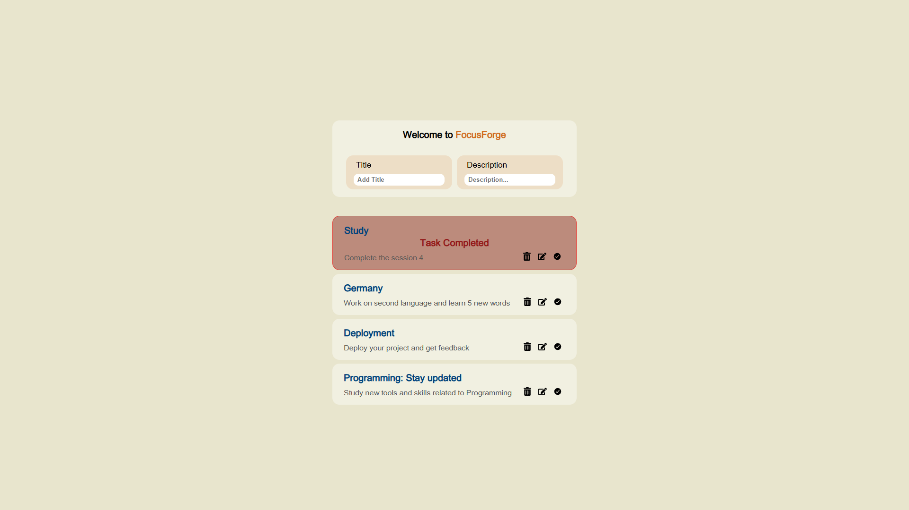

# Welcome to FocusForge web application!

**FocusForge** is built for managing tasks and helps you stay focused on whatever you want to do. It provides you with features like Delete, Edit, and highlight for completed tasks. Also stores your tasks, so you don't have to be worried about closing entire app.

## What you'll see:

## Live Demo

Please click [here](https://pixedit.github.io/FocusForge/) to see Live Demo

## Features

- Task management (Edit, Delete, Toggle completed)
- Easy to use and friendly design
- localStorage for storing tasks
- Responsive support for different screen sizes

## Built with

- HTML5
- CSS3
- Vanilla JavaScript (ES6)
- React

## Author

Milad - [GitHub Profile](https://github.com/pixedit)

## Upcoming Features in the future:

- Optional Timeline to give a task limited time frame
- Enhanced design and layout
- Notifications for more interactions between the user and tasks

## How to Run Locally

1. Clone: `git clone https://github.com/pixedit/FocusForge.git`
2. Navigate into the folder: `cd FocusForge`
3. Install dependencies: `npm install` or `npm i`
4. Run the app: `npm run dev`
